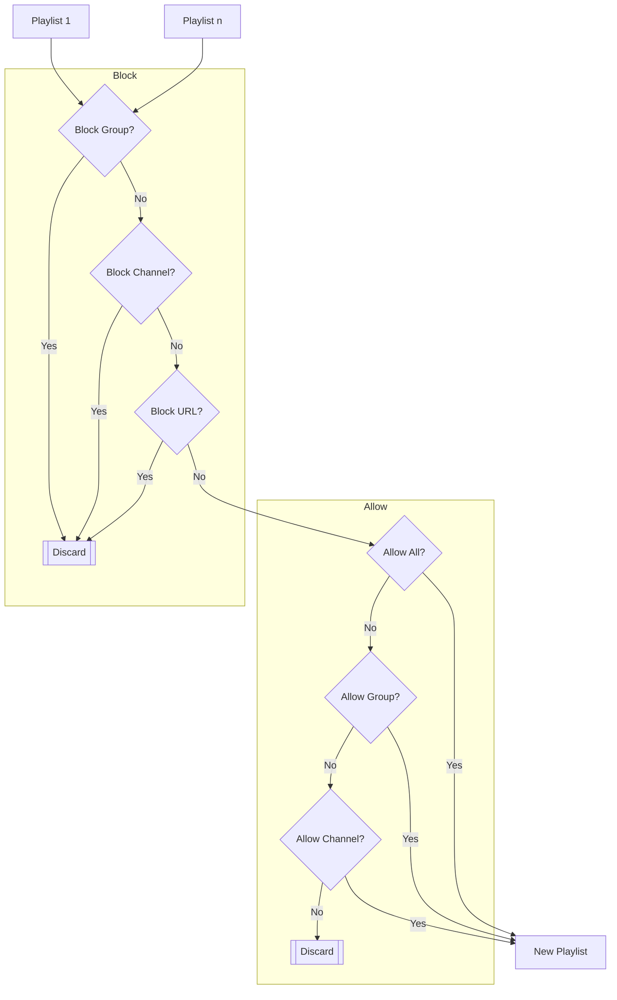

# pefti
Playlist and EPG Filter/Transformer for IPTV

*pefti* is a command-line application that takes multiple IPTV playlists and Electronic Program Guides (EPG) and creates a new playlist file and a new EPG file. The IPTV playlists are filtered and transformed according to a user configuration. This enables renaming channels, regrouping channels, choosing the order of channels and groups, removing/adding/changing channel tags, and more. The EPGs are filtered so that the new EPG file only contains data for the channels in the new playlist file. Filtering the playlist and EPG files reduces the file sizes by removing unwanted data, this enables media players to load the files faster.

Playlist files must be in [M3U format](https://en.wikipedia.org/wiki/M3U), *pefti* only recognizes two extended M3U directives: #EXTM3U and #EXTINF.

EPG files must be in [XMLTV format](https://wiki.xmltv.org/index.php/XMLTVFormat).

Note that *pefti* is not interactive. It is intended to be run periodically either directly from the command-line or from a script, to create a new playlist and EPG with minimal effort.

## Assumptions

For playlists, *pefti* assumes that each channel uses the `group-title` tag for its group name and the `tvg-id` tag for linking to the EPG:
```
#EXTINF:-1 tvg-id="NASATV" group-title="USA",NASA TV
```
For EPGs, *pefti* assumes that the link to the playlist is in the `channel` tag:
```
<programme start="20240208090000 -0500" stop="20240208100000 -0500" channel="NASATV">
```

## Build

*pefti* requires CMake 3.14 or greater for building. Building *pefti* from source code follows the typical CMake process:
```
git clone https://github.com/junglerock99/pefti.git
cd pefti
mkdir build
cd build
cmake -DCMAKE_BUILD_TYPE=Release ..
make
```
External packages required for building are libcurl, libxml2 and openssl.

## Usage

Before running *pefti*, a configuration file must be created. TOML format is used for the configuration, the full TOML specification is at https://toml.io, but it may be easiest to copy and modify one of the example configurations below to get started. The name of the configuration file is specified on the command-line:
```
> pefti /home/user/config.toml
```

## Example Configurations

Note that these examples show a small number of channels for brevity, a real playlist typically contains many channels.

### Merge Playlists

This configuration merges multiple playlists into one new file. This would produce a new file named `new.m3u` which contains all of the IPTV channels from both iptv-1.m3u and iptv-2.m3u. This is a special case where no filtering is performed. Because no groups or channels are specified, *pefti* copies all groups and channels to the `new.m3u` output file.
```
[resources]
playlists = ["https://example.com/iptv-1.m3u","https://example.com/iptv-2.m3u"]
new_playlist = "new.m3u"
```

### Block Groups

This configuration filters out groups. The new file contains all channels from the input playlists except for channels that have a `group-title="News"` tag or a `group-title="Weather"` tag.
```
[resources]
playlists = ["https://example.com/iptv-1.m3u","https://example.com/iptv-2.m3u"]
new_playlist = "new.m3u"
[groups]
block = ["News","Weather"]
```

### Allow Groups

This configuration filters out all groups from a playlist except for the allowed groups. The new playlist file only contains channels from the input playlists that have a `group-title="News"` tag or a `group-title="Weather"` tag.
```
[resources]
playlists = ["https://example.com/iptv-1.m3u","https://example.com/iptv-2.m3u"]
new_playlist = "new.m3u"
[groups]
allow = ["News","Weather]
```

### Allow Channels

This configuration creates a new playlist file that contains only the specified channels. The new playlist will contain only three channels, two in the USA group and one in the Canada group.
```
[resources]
playlists = ["https://example.com/iptv-1.m3u","https://example.com/iptv-2.m3u"]
new_playlist = "new.m3u"
[channels]
allow = [  
  "USA", [ 
  {allow = ["Nasa TV"]},
  {allow = ["Reuters TV"]},
  ],
  "Canada", [ 
  {allow = ["TSC"]},
  ]
]
```

### All Currently Supported Features

The new playlist file will contain two channels in the USA group, one channel in the Canada group, plus all channels in the Music group, in that order. If the URL for any channel matches one of the blocked URLs then that channel will be filtered out. If there are multiple instances of the same channel in the input playlists, then a maximum of three instances will appear in the new playlist file because `number_of_duplicates` is set to 2. `duplicates_location` specifies where the duplicates will be located, in this case they will be placed at the end of the playlist. The `sort_qualities` array specifies which instances of a channel are preferred when there are multiple instances. *pefti* will search the channel's name to find the preferred instance. `tags_block` allows you to filter out tags, in this case the `tvg-logo` and `tvg-name` tags will not appear in the new playlist file for any channel. Any channel that contains "4K", "SD" or "spanish" in the channel name in the input playlists will be filtered out.
```
[resources]
playlists = ["https://example.com/iptv-1.m3u","https://example.com/iptv-2.m3u"]
new_playlist = "new.m3u"
[groups]
block = []
allow = ["Music"]
[urls]
block = ["https://example.com/channel/123","https://example.com/channel/234"]
[channels]
copy_group_title = true
number_of_duplicates = 2
duplicates_location = "append_to_group"
sort_qualities = ["FHD","1080","HD","720"]
tags_block = ["tvg-logo","tvg-name"]
block = ["4K","SD","spanish"]
allow = [  
  "USA", [ 
  {i=["Nasa TV"], e=["Media","UHD"], t={tvg-id = "Nasa TV HD"}},
  {i=["Reuters TV"]},
  ],
  "Canada", [ 
  {i=["TSC"], n="Shopping Channel"},
  ]
]
```

## How It Works

The diagram below shows how channels in the playlists are filtered to create a new playlist. There are two phases of filtering: 1) blocking channels and 2) allowing channels.

### Filters

#### Block Group

The channel will be discarded if its `group-title` tag matches any of the entries in `[groups] block` in the configuration.

#### Block Channel

The channel will be discarded if its name contains any of the entries in `[channels] block` in the configuration.

#### Block URL

The channel will be discarded if its URL matches any of the entries in `[urls] block` in the configuration.

#### Allow All

The channel will be added to the new playlist if both `[groups] allow` and `[channels] allow` in the configuration are empty.

#### Allow Group

The channel will be added to the new playlist if its `group-title` tag matches any of the entries in `[groups] allow` in the configuration.

#### Allow Channel

The channel will be added to the new playlist if it matches any of the entries in `[channels] allow` in the configuration. It is a match if the channel name contains all of the entries in an `i` (include) array and none of the entries in the corresponding `e` (exclude) array.



## Configuration Options

The section describes the configuration options used by *pefti*.

The configuration options are grouped using TOML tables. A table starts with the table name in square brackets, e.g. `[groups]`. Following the table name are the options for that table, written as key=value pairs. More than one value can be assigned by placing the values in a TOML array using square brackets, e.g. `option = ["value1","value2","value3"]`. 

### [resources] table
Key | Type | Value 
--- | --- | ---
playlists | Array of text strings | URLs of the input playlists
new_playlist | Text string | Filename for the new playlist
epgs | Array of text strings | URLs of the input EPGs
new_epg | Text string | Filename for the new EPG

### [groups] table
Key | Type | Value 
--- | --- | ---
block | Array of text strings | Names of groups to filter. A channel will be filtered out if it has a `group-title` tag that matches any of the text strings in this array. Case sensitive.
allow | Array of text strings | Names of groups to not filter. Only channels with a `group-title` tag that matches one of the text strings in this array will be copied to the new playlist file. Case sensitive.

### [urls] table
Key | Type | Value 
--- | --- | ---
block | Array of text strings | URLs to filter out. A channel will be filtered out if its URL matches any of the text strings in this array.

### [channels] table
Key | Type | Value 
--- | --- | ---
copy_group_title | Boolean | 
number_of_duplicates | Integer | When there are multiple instances of a channel in the input playlist files, specifies how many duplicate instances to copy to the new playlist file.
duplicates_location | Text string | When there are multiple instances of a channel and `number_of_duplicates` is greater than zero, specifies where the duplicate channels are to be located in the new playlist file. Options are `inline` where all instances are located together, or `append_to_group` where duplicate instances are moved to the end of the group.
sort_qualities | Array of text strings | When there are multiple instances of a channel, searches the channel names to find the best quality. This array should contain the text strings to search for in order of preference, e.g. `["4K","1080","720"]`.
tags_block | Array of text strings | Tags to filter out, e.g. `["tvg-id","tvg-name"]`.
block | Array of text strings | Filters out a channel if its name contains any of these text strings
allow | Array | Contains one table for each channel that should be added to the playlist. See below for details.

#### [channels] allow table
Key | Type | Value 
--- | --- | ---
i | Array of text strings | The channel name must include all of these substrings
e | Array of text strings | The channel name must exclude all of these substrings
n | Text string | New name for the channel. If a new name is not specified then the first entry in the i (include) array will be used as the new name for the channel.
t | Table | Contains tags to add to the channel. Each tag is a key=value pair, e.g. `t={group-title="News",tvg-id="MYCHANNEL"}`. If the channel already contains the tag then it will be overwritten.

## Source Code

*pefti* is written in C++20 and follows the [Google C++ Style Guide](https://google.github.io/styleguide/cppguide.html) except that it uses exceptions.

